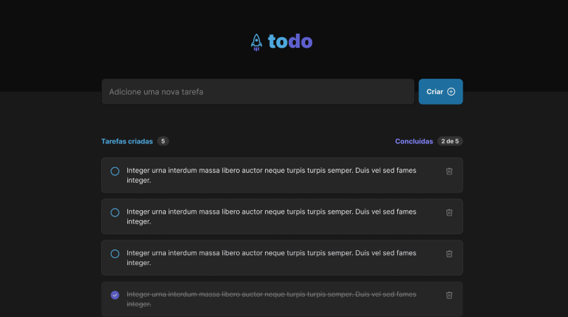

# RocketSeat - Ignite desafio 01 de react Js

## Acessar o projeto link
https://ignite-react-js-desafio01-qq2epbio2-jromarioss.vercel.app/

## Para instalar as dependências
npm install

## Para iniciar o projeto
npm run dev

